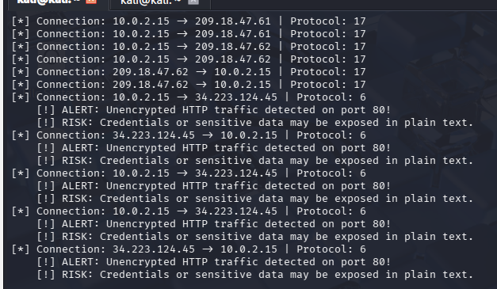

# Network-Security-Sniffer
A lightweight network monitoring and vulnerability detection tool developed in Python using the Scapy library. This project demonstrates the fundamentals of network traffic analysis, protocol identification, and real-time security monitoring.

## 🚀 Features
* **Real-time Capture:** Intercepts live IP packets passing through the Network Interface Card (NIC).
* **Protocol Identification:** Automatically categorizes traffic including TCP (6), UDP (17), and ICMP (1).
* **Vulnerability Detection:** Specifically monitors for unencrypted **HTTP (Port 80)** traffic.
* **Security Alerting:** Flags "Cleartext Exposure" risks in the terminal, identifying potential data leaks in unencrypted streams.
* **Linux Optimized:** Built for Kali Linux environments using administrative privileges for raw socket access.

## 🛠️ How It Works
The script utilizes a custom callback function to process each captured packet. It inspects the IP and Transport layers to extract:
1.  **Source/Destination IP:** Tracks the flow of data between hosts.
2.  **Layer 4 Analysis:** Identifies if the packet is using TCP or UDP.
3.  **Security Logic:** If a TCP packet is detected on Port 80, the tool triggers a security alert, notifying the user that sensitive data (credentials, PII) may be traveling unencrypted.

## 📊 Project in Action
Below is a capture of the sniffer identifying unencrypted traffic while browsing an insecure site in a lab environment:


*Figure 1: The sniffer successfully identifies Protocol 6 (TCP) and flags a Port 80 risk.*

Usage

Clone the repo:
```bash
   git clone [https://github.com/your-username/python-sniffer.git](https://github.com/your-username/python-sniffer.git)

Install dependencies:
sudo apt install python3-scapy

Run with sudo:
sudo python3 sniffer.py

Legal Disclosure: 
This tool is intended for educational and authorized security testing purposes only. It was developed to better understand network forensics and defensive security measures within a controlled lab environment.
